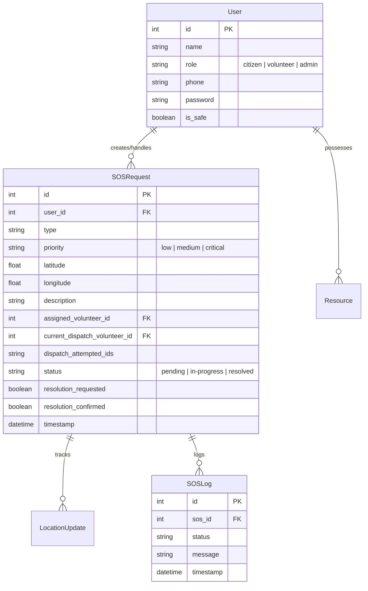

# 🇮ReliefLink: Crisis Response & Cascading Dispatch Platform

**ReliefLink (IRL)** is a state-of-the-art, high-availability crisis response and rescue platform. Built using a robust React frontend and a Flask backend, the system orchestrates real-time SOS dispatches, live geolocation tracking, and real-time public emergency warnings.

Featuring specialized interfaces for **Citizens**, **Volunteers**, and **Admins**, the platform operates on a reactive, event-driven architecture powered by WebSockets (Socket.IO) and robust SQLite persistence.

---
### 1. Interactive Citizen Portal (`/citizen`)
* **Instant SOS Dispatch**: One-click emergency declaration with dynamic category selection (Food, Medical, Rescue, Shelter) and priority scaling (Low, Medium, Critical).
* **Live Volunteer Mapping**: Citizens view real-time movements of online volunteers represented by custom violet Leaflet markers moving dynamically across the map.
* **Proximity Matching Badge**: Reassuring display notifying citizens of the exact number of active volunteers within a 50km radius ("*X volunteers nearby — dispatching to closest first*").
* **Safety Confirmation Flow**: Interactive confirmation system allowing citizens to confirm their safety ("*Yes, I am Safe*") or request continued assistance ("*No, Still Need Help*") once a volunteer marks an event as resolved.

### 2. Uber-Style Cascading Dispatch Engine
* **Proximity Haversine Sorting**: On SOS creation, the backend calculates the exact distance to all active online volunteers and targets the closest responder.
* **Targeted Ringing Overlay**: The selected volunteer's screen triggers a high-priority, full-screen overlay with a blurred backdrop, flashing red emergency siren animations, and precise incident coordinates.
* **20-Second Response Deadline**: Volunteers are given 20 seconds to respond before the backend triggers a background cascade, updating the dispatch queue state.
* **Sequential Escalation**: If the volunteer declines or times out, the engine appends them to the attempted list, clears the target, and automatically recurses to ring the next nearest eligible volunteer within 50km.
* **Self-Healing UI**: Overlay buttons gracefully dismiss and sync the dashboard even if the request times out or succeeds elsewhere on the network.

### 3. Geolocation Synchronization
* **High-Frequency GPS Broadcast**: Volunteers automatically capture their GPS coordinates using `navigator.geolocation.watchPosition` and periodically publish location updates to the Flask event loop.
* **Smart Map Centering**: The volunteer map automatically centers on their current physical coordinates on the first tracked point, allowing full manual dragging thereafter without snap-back.
* **Alignment Fallback**: Defaults map coordinates to Chandigarh (`[30.8775, 76.8740]`) to ensure seamless testing alignment on local browsers where location permissions are disabled.

### 4. Admin Control Center (`/admin`)
* **Real-Time Dashboards**: High-impact crisis dashboard reporting critical statistics (Total, Pending, Dispatched, Resolved requests).
* **Geographical Incident Feed**: Visualizes all active emergencies dynamically on an interactive map.
* **Real-Time Push Broadcast Alerts**: Direct warning dispatch tool enabling admins to send instant red emergency banners to all active users on the network (Citizen & Volunteer).

---

## 🛠️ Architecture & Reliability

* **Self-Healing WebSockets**: Configured to force polling transport (`transports: ['polling']`) to maintain solid stability under hot module replacement, guarded by `safeEmit` helpers to queue messages before connection.
* **Fallback Status Syncing**: Added dual status polling (every 5s on citizen portal, every 8s on volunteer portal) to guarantee 100% UI consistency even under complete socket disconnection or network latency.
* **Chronological Timeline Logs**: Every lifecycle state transition (dispatch, ring, timeout, decline, accept, confirm) writes a permanent log history linked to the SOS request.

---

## 🗄️ Database Models (SQLite)

The backend maintains six highly optimized relational tables:



---

## 🚀 How to Run the Project

You will need to open **two separate terminal windows/tabs** to run the frontend and backend simultaneously.

### 1. Running the Backend Server (Flask)
The backend handles the API, database connection, and WebSocket loops. It runs on `http://127.0.0.1:5001`.

1. Open your terminal and navigate to the backend directory:
   ```bash
   cd backend
   ```
2. Activate the Python virtual environment:
   * **macOS / Linux:**
     ```bash
     source venv/bin/activate
     ```
   * **Windows:**
     ```cmd
     .\venv\Scripts\activate
     ```
3. Start the server:
   ```bash
   python app.py
   ```

---

### 2. Running the Frontend Server (React)
The frontend provides the interactive dashboard interfaces. It runs on `http://127.0.0.1:5173`.

1. Open a second terminal window/tab and navigate to the frontend directory:
   ```bash
   cd frontend
   ```
2. Start the development server:
   ```bash
   npm run dev
   ```
3. Open **`http://127.0.0.1:5173/`** in your browser to view the platform.

---

## 👥 Demo Accounts for Testing

The database is seeded automatically with the following Indian demo accounts (prefilled on the Login screen):

* **Citizen**: `1234567890` (Password: `password`) ➔ **Citizen Rahul**
* **Volunteer**: `0987654321` (Password: `password`) ➔ **Volunteer Priya**
* **Admin**: `1112223333` (Password: `password`) ➔ **Admin Rajesh**

---

## ⚠️ Important Testing Note (Avoiding Session Conflicts)

Modern browsers share local storage (where tokens are saved) across all open tabs of the same website. 

To test **real-time citizen and volunteer interactions** on the same computer:
1. Open a **normal browser tab** for the **Citizen Portal** (logged in as **Citizen Rahul**).
2. Open an **Incognito / Private Window** (or a different browser like Safari/Firefox) for the **Volunteer Portal** (logged in as **Volunteer Priya**).

This prevents token overwrites, allowing dispatches, rings, declines, and resolutions to sync flawlessly!
