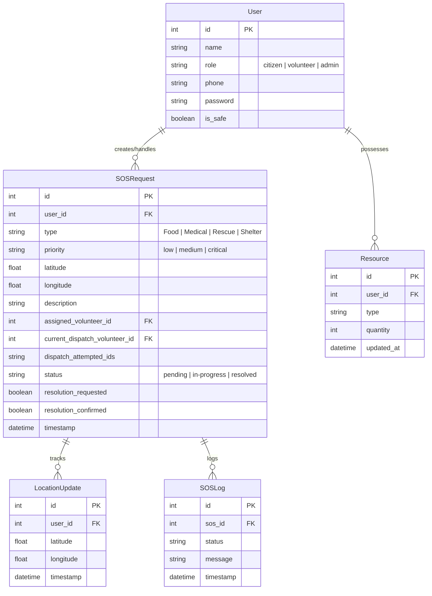

# 🚨 ReliefLink: Crisis Response & Cascading Dispatch Platform

**ReliefLink** is a state-of-the-art, high-availability crisis response and rescue platform designed to efficiently coordinate emergency response operations. Built with a modern React frontend and robust Flask backend, the system orchestrates real-time SOS dispatch, volunteer coordination, and crisis management through an event-driven architecture powered by WebSockets (Socket.IO) and SQLite persistence.

Featuring specialized interfaces for **Citizens** (emergency requesters), **Volunteers** (responders), and **Admins** (crisis coordinators), ReliefLink enables rapid emergency response with proximity-based volunteer dispatch and real-time status synchronization.

---

## 📋 Table of Contents

- [Key Features](#key-features)
- [Architecture Overview](#architecture-overview)
- [Project Structure](#project-structure)
- [Technology Stack](#technology-stack)
- [Getting Started](#getting-started)
- [Database Models](#database-models)
- [Demo Accounts](#demo-accounts)
- [Testing Guide](#testing-guide)
- [API Overview](#api-overview)

---

## 🎯 Key Features

### 1. **Interactive Citizen Portal** (`/citizen`)
- **Instant SOS Dispatch**: One-click emergency declaration with dynamic category selection (Food, Medical, Rescue, Shelter) and priority scaling (Low, Medium, Critical)
- **Live Volunteer Mapping**: Real-time visualization of online volunteers on an interactive map with custom markers showing current locations
- **Proximity Matching Badge**: Display showing exact number of active volunteers within a 50km radius with reassurance messaging
- **Safety Confirmation Flow**: Post-dispatch confirmation system allowing citizens to confirm safety ("Yes, I am Safe") or request continued assistance ("No, Still Need Help")
- **Request History**: Complete chronological log of all SOS requests with status tracking

### 2. **Uber-Style Cascading Dispatch Engine**
- **Proximity-Based Matching**: Haversine formula calculates exact distance to all active volunteers, targeting the closest responder first
- **Targeted Ringing Overlay**: High-priority full-screen notification with flashing red emergency siren animations and incident coordinates
- **20-Second Response Deadline**: Volunteers receive 20-second window to respond; automatic escalation to next volunteer on timeout or decline
- **Sequential Escalation**: Failed dispatch attempts are logged; system automatically cascades to next nearest eligible volunteer
- **Self-Healing UI**: Overlay gracefully dismisses and syncs dashboard even under network disruptions or simultaneous dispatch acceptance

### 3. **Geolocation Synchronization**
- **High-Frequency GPS Broadcast**: Real-time volunteer location tracking using `navigator.geolocation.watchPosition`
- **Smart Map Centering**: Map auto-centers on volunteer's current location on first tracked point; allows manual dragging thereafter
- **Alignment Fallback**: Defaults to Chandigarh coordinates for seamless testing when location permissions are disabled
- **Continuous Updates**: Periodic location broadcasts ensure map remains current across all connected clients

### 4. **Admin Control Center** (`/admin`)
- **Real-Time Crisis Dashboard**: Live statistics including Total, Pending, Dispatched, and Resolved requests
- **Geographical Incident Feed**: Interactive map visualization of all active emergencies with incident details
- **Real-Time Push Broadcast Alerts**: Direct alert dispatch tool enabling admins to send instant emergency banners to all active users
- **Analytics & Reporting**: Historical data on response times, volunteer availability, and incident trends

---

## 🏗️ Architecture Overview

### Design Principles

- **Event-Driven Architecture**: WebSocket-based real-time communication eliminates polling overhead
- **Self-Healing WebSockets**: Configured to force polling transport (`transports: ['polling']`) for stability under HMR; `safeEmit` helpers queue messages during disconnections
- **Fallback Status Syncing**: Dual polling strategies (5s for citizens, 8s for volunteers) guarantee UI consistency during network interruptions
- **Chronological Logging**: Every lifecycle event (dispatch, ring, timeout, decline, accept, confirm) creates permanent audit trail
- **Scalable Database**: SQLite with optimized relational schema supporting concurrent operations and complex queries

### Technology Stack

| Layer | Technology | Purpose |
|-------|-----------|---------|
| **Frontend** | React 18 | Interactive UI components |
| **Bundler** | Vite | Fast dev server & optimized builds |
| **Styling** | CSS | Responsive UI design |
| **Mapping** | Leaflet | Interactive map visualization |
| **Real-Time** | Socket.IO | WebSocket communication |
| **Backend** | Flask | REST API & WebSocket server |
| **Database** | SQLite | Persistent data storage |
| **Language Stats** | 74.5% JS, 23% Python, 1.7% CSS, 0.8% HTML | |

---

## 📁 Project Structure

```
ReliefLink/
├── frontend/                  # React + Vite application
│   ├── src/
│   │   ├── components/       # React components (Citizen, Volunteer, Admin)
│   │   ├── pages/            # Route pages
│   │   ├── socket/           # Socket.IO client setup
│   │   └── App.jsx           # Main app component
│   ├── package.json
│   └── vite.config.js
│
├── backend/                   # Flask application
│   ├── app.py                # Flask server & WebSocket setup
│   ├── models.py             # SQLite ORM models
│   ├── routes/               # API endpoints
│   ├── database.db           # SQLite database (auto-seeded)
│   └── requirements.txt      # Python dependencies
│
└── README.md                 # This file
```

---

## 🛠️ Getting Started

### Prerequisites

- **Node.js** 16+ (for React frontend)
- **Python** 3.8+ (for Flask backend)
- **npm** or **yarn** (package manager)

### Installation & Setup

#### Step 1: Clone the Repository

```bash
git clone https://github.com/arunchahal/ReliefLink.git
cd ReliefLink
```

#### Step 2: Set Up Backend (Terminal Window 1)

```bash
cd backend

# Create virtual environment
python -m venv venv

# Activate virtual environment
# On macOS / Linux:
source venv/bin/activate

# On Windows:
.\venv\Scripts\activate

# Install dependencies
pip install -r requirements.txt

# Run Flask server
python app.py
```

The backend will start on **`http://127.0.0.1:5001`**

#### Step 3: Set Up Frontend (Terminal Window 2)

```bash
cd frontend

# Install dependencies
npm install

# Start development server
npm run dev
```

The frontend will start on **`http://127.0.0.1:5173`**

#### Step 4: Access the Application

Open your browser and navigate to **`http://127.0.0.1:5173`**

---

## 🗄️ Database Models

### Entity Relationship Diagram



### Table Descriptions

| Table | Purpose |
|-------|---------|
| **User** | Stores all user accounts with role-based access control |
| **SOSRequest** | Tracks emergency requests with dispatch state machine |
| **SOSLog** | Immutable audit log of all state transitions |
| **LocationUpdate** | High-frequency GPS coordinates for volunteer tracking |
| **Resource** | Volunteer resource availability (food, medical supplies, etc.) |

---

## 👥 Demo Accounts for Testing

The database is pre-seeded with the following test accounts:

| Role | Phone | Password | Name |
|------|-------|----------|------|
| **Citizen** | `1234567890` | `password` | Citizen Rahul |
| **Volunteer** | `0987654321` | `password` | Volunteer Priya |
| **Admin** | `1112223333` | `password` | Admin Rajesh |

These credentials are **prefilled on the login screen** for convenient testing.

---

## ⚠️ Testing Guide

### Avoiding Session Conflicts

Modern browsers share local storage (where authentication tokens are saved) across all open tabs of the same website. To properly test real-time citizen-volunteer interactions on a single computer:

#### Method 1: Incognito/Private Windows
1. Open a **normal browser tab** for **Citizen Portal** (logged in as Citizen Rahul)
2. Open an **Incognito / Private Window** for **Volunteer Portal** (logged in as Volunteer Priya)

#### Method 2: Different Browsers
1. Use **Chrome** for Citizen Portal
2. Use **Firefox** (or Safari) for Volunteer Portal

This prevents token overwrites and allows dispatches, rings, declines, and resolutions to sync flawlessly.

### Testing Workflow

1. **Login as Citizen Rahul** → Create an SOS request (select category and priority)
2. **Check Volunteer Dashboard** → Ringing overlay should appear on Volunteer's screen
3. **Respond as Volunteer Priya** → Accept or decline the dispatch
4. **Verify Real-Time Updates** → Both portals update immediately via WebSocket
5. **Confirm Safety** → Citizen confirms safety or requests continued assistance
6. **View Admin Dashboard** → Admin sees incident appear on crisis dashboard

---

## 🔌 API Overview

### WebSocket Events (Socket.IO)

#### From Client to Server

- `user_location` - Send volunteer GPS coordinates
- `request_sos` - Create new emergency request
- `respond_dispatch` - Volunteer accepts/declines dispatch
- `confirm_safety` - Citizen confirms safety status
- `broadcast_alert` - Admin sends network-wide alert

#### From Server to Client

- `dispatch_ring` - Notify volunteer of new dispatch
- `dispatch_cascade` - Escalate to next volunteer
- `request_update` - Update SOS request status
- `volunteer_location` - Broadcast volunteer coordinates
- `alert_notification` - Admin alert received

### REST API Endpoints (Flask)

| Method | Endpoint | Purpose |
|--------|----------|---------|
| `POST` | `/api/auth/login` | User authentication |
| `GET` | `/api/sos/list` | Fetch SOS requests |
| `GET` | `/api/users/online` | Get online volunteers |
| `GET` | `/api/admin/stats` | Dashboard statistics |

---

## 🚀 Deployment

### Building for Production

```bash
# Frontend
cd frontend
npm run build

# Output: dist/

# Backend
# Update app.py to use production WSGI server (e.g., Gunicorn)
gunicorn --worker-class eventlet -w 1 app:app
```

### Hosting Recommendations

- **Frontend**: Vercel, Netlify, AWS S3 + CloudFront
- **Backend**: AWS EC2, Heroku, Railway, DigitalOcean
- **Database**: SQLite (for small scale) → PostgreSQL (for production scale)

---

## 🤝 Contributing

Contributions are welcome! Please follow these guidelines:

1. Fork the repository
2. Create a feature branch (`git checkout -b feature/amazing-feature`)
3. Commit your changes (`git commit -m 'Add amazing feature'`)
4. Push to the branch (`git push origin feature/amazing-feature`)
5. Open a Pull Request

---

## 📝 License

This project is open source and available under the MIT License.

---

## 💬 Support & Contact

For questions or issues, please open a GitHub issue or contact the maintainer directly.

**Repository**: [github.com/arunchahal/ReliefLink](https://github.com/arunchahal/ReliefLink)

---

## 🙏 Acknowledgments

Built with dedication to improve crisis response coordination and volunteer-citizen communication during emergencies.

**Last Updated**: June 2026
